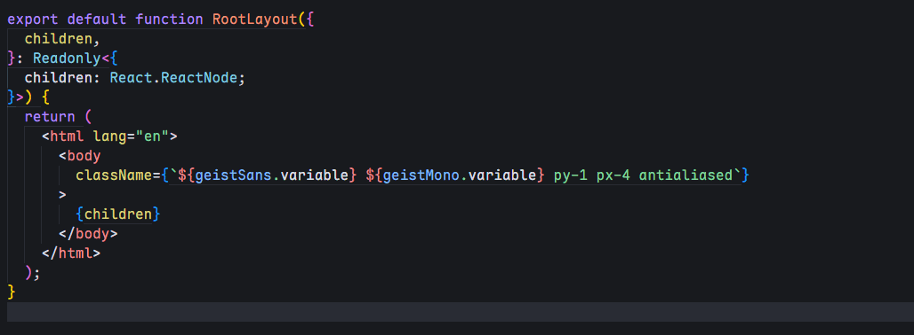
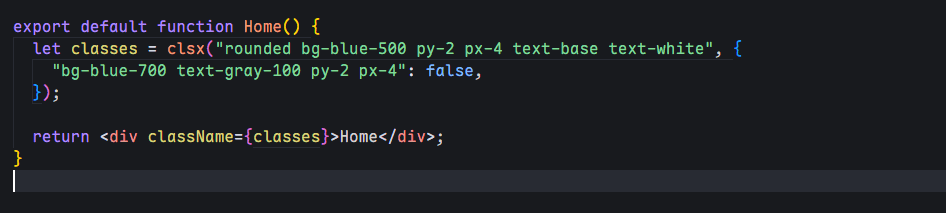

最近在学习 NextJs，在使用 Tailwind CSS 时，看到 Tailwind 官方的一篇文章： [Automatic Class Sorting with Prettier](https://tailwindcss.com/blog/automatic-class-sorting-with-prettier) ，里面介绍了如何使用 Prettier 插件来自动排序 Tailwind CSS 类名。

我觉得这个东西对于强迫症的我来说还是非常有用的，这里就简单的记录一下使用教程。

> 这里只是简单的介绍和使用，更多的用法可以查看 [prettier-plugin-tailwindcss](https://github.com/tailwindlabs/prettier-plugin-tailwindcss)。

## 安装插件

首先安装插件 `prettier-plugin-tailwindcss` 为开发依赖项：

```bash
pnpm add -D prettier prettier-plugin-tailwindcss
```

然后在项目根目录下创建一个名为 `.prettierrc` 的配置文件，内容如下：

```json
// .prettierrc
{
  "plugins": ["prettier-plugin-tailwindcss"]
}
```

## 使用插件

之后你可以在 `package.json` 文件中添加一个脚本来运行 Prettier：

```json
// package.json
{
  "scripts": {
    "format": "prettier --write --log-level warn ."
  }
}
```

这样你就能通过运行 `pnpm format` 来自动排序 Tailwind CSS 类名了。

为了方便起见，你也可以在 `VS Code` 中安装 `Prettier - Code formatter` 插件，这样每次写完一部分样式就可以使用快捷键进行格式化。



## 对函数调用中的类进行排序

如果你在项目中使用了 `clsx` 来动态组合类名，你可以在 `.prettierrc` 的配置文件中添加以下内容：

```json
// .prettierrc
{
  "tailwindFunctions": ["clsx"]
}
```

这样，Prettier 就会在格式化时自动对 `clsx` 函数中的类名进行排序。


