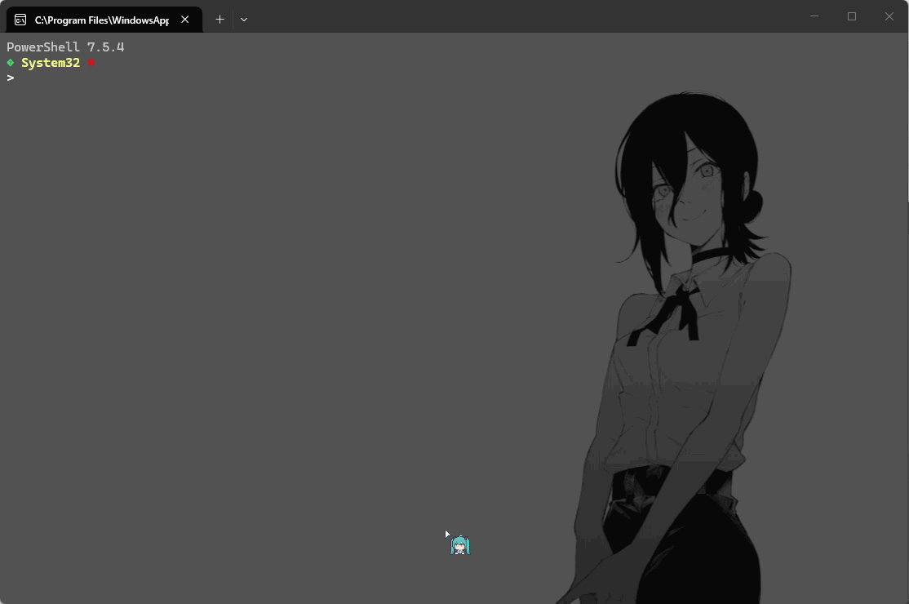

由于在 Windows 上配置开发环境过于麻烦，还可能会有**环境变量污染**、**多版本冲突**等问题，所以目前我推荐的方案是：**[Scoop](https://scoop.sh/)**（包管理器）+ **[Mise](https://mise.jdx.dev/)**（运行时版本管理）。

为什么要这样配：

- **非侵入式**：所有软件和开发环境安装在用户目录下 （`~/scoop` 和 `~/AppData/Local/mise/shims`），不污染系统注册表。
- **版本隔离**：不同项目使用不同版本的 Node/Python/Go，互不干扰。
- **代码化**：环境配置即代码，可以通过配置文件 （`mise.toml`） 在团队间共享。

## 安装 Scoop

打开 PowerShell （版本 >= 5.1），执行安装脚本：

```shell
# 设置执行策略，允许本地脚本运行
Set-ExecutionPolicy -ExecutionPolicy RemoteSigned -Scope CurrentUser

# 下载并安装 Scoop
Invoke-RestMethod -Uri https://get.scoop.sh | Invoke-Expression
```

安装完成后，不要急着使用，可以先做两件事：**配置多线程下载**和**添加必备 Bucket （软件库）**。

```shell
# 1. 必需的依赖：Git （Scoop 依赖 Git 来管理 Bucket）
# （注：Git 安装时会自动附带 7-zip）
scoop install git

# 2. 添加常用 Bucket （软件库）
# main: 这是 Scoop 官方默认的库，包含了经过严格审查的开源 CLI 工具
scoop bucket add main
# extras: 包含大量非 CLI 的常用软件
scoop bucket add extras
# versions: 如果你需要旧版本的软件，可以添加这个
scoop bucket add versions

# 3. 安装 Aria2 以开启多线程下载
scoop install aria2
scoop config aria2-enabled true
# 设置为 16 线程（视网络情况调整）
scoop config aria2-max-connection-per-server 16
scoop config aria2-split 16
```

### 优化终端体验

#### 安装 PSCompletions

安装好 Scoop 后，我们可以在去安装一个非常实用的工具：**[PSCompletions](https://pscompletions.abgox.com/zh-CN/)**

这是一个 PowerShell 的命令补全管理器，我们可以通过 Scoop 进行安装。

使用 Scoop 安装的时候，需要先添加对应的 Bucket：

```shell
# 添加对应的 Bucket
scoop bucket add abyss https://github.com/abgox/abyss

# 安装 PSCompletions
scoop install abyss/abgox.PSCompletions
```

#### 配置 PowerShell Profile

`Profile` 文件相当于 Linux 的 `.bashrc` 或 `.zshrc`，是终端启动时的初始化脚本。

我们通过脚本安全地创建并编辑它：

```shell
New-Item -ItemType Directory -Path "$env:USERPROFILE\Documents\PowerShell" -Force
New-Item -ItemType File -Path "$env:USERPROFILE\Documents\PowerShell\Microsoft.PowerShell_profile.ps1" -Force
notepad "$env:USERPROFILE\Documents\PowerShell\Microsoft.PowerShell_profile.ps1"
```

这会在 `~/Documents` 里创建一个文件夹 `PowerShell`，并且在这个文件夹下创建 `Microsoft.PowerShell_profile.ps1` 文件。

然后我们在打开的文件中写入：

```ps1
# 导入自动补全
Import-Module PSCompletions
```

之后重启终端，然后我们可以尝试着添加 git 和 scoop 的命令补全：

```shell
psc add git scoop
```



### 新电脑快速配置

换了新电脑，如何一键恢复所有 Scoop 软件？

**以 JSON 格式导出已安装的应用程序、存储库（以及可选的配置）**：

```shell
scoop export > scoop_backup.json
```

**从指定的 JSON 格式文件导入已安装的应用程序、存储库（以及配置）**：

```shell
scoop import scoop_backup.json
```

## 安装 Mise

我们这里可以直接使用 Scoop 进行安装：

```shell
scoop install mise
```

安装好后，同样的，使用 psc 补全命令：

```shell
psc add mise
```

### 配置开发环境

安装好 Mise 后，我们可以尝试安装下 Node 环境：

```shell
mise use --global node@24
```

安装后，我们会发现执行 `node -v` 的时候没有效果，这是因为我们还没有激活 Mise，我们打开 PowerShell：

```shell
$shimPath = "$env:USERPROFILE\AppData\Local\mise\shims"
$currentPath = [Environment]::GetEnvironmentVariable('Path', 'User')
$newPath = $currentPath + ";" + $shimPath
[Environment]::SetEnvironmentVariable('Path', $newPath, 'User')
```

这个脚本的作用就是把 mise 的 `shims` 目录加入到当前用户的 `PATH` 环境变量中，然后你就可以正常的使用 `node` 命令了。

### 多项目版本自动切换

假设你同时维护一个老项目（Node 14 + Python 3.8）和一个新项目（Node 24 + Python 3.12）。

**老项目目录：**

```shell
cd C:\Projects\LegacyApp
mise use node@14 python@3.8
```

**新项目目录：**

```shell
cd C:\Projects\ModernApp
mise use node@24 python@3.12
```

此时 mise 会在当前目录生成一个 mise.toml 文件。

当你在终端 `cd` 进入不同项目目录时，`node -v` 和 `python --version` 的结果会自动变化，无需手动运行任何命令。

### 团队环境统一

新入职员工经常配置不好环境？直接将 `mise.toml` 提交到 Git 仓库根目录。

**mise.toml**：

```toml
[tools]
node = "24"
python = "3.12"
```

**新员工只需做一步：**

```shell
# 拉取代码后进入目录
git clone xxx
cd xxx

# 一键安装所有依赖
mise install
```
