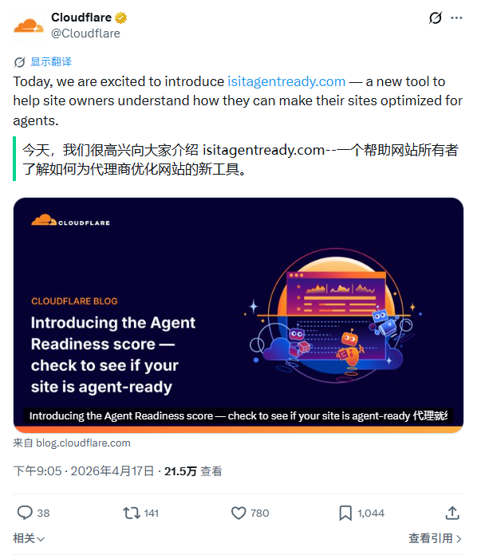
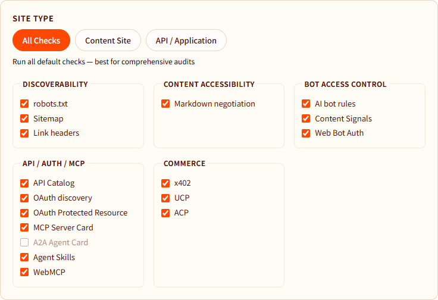
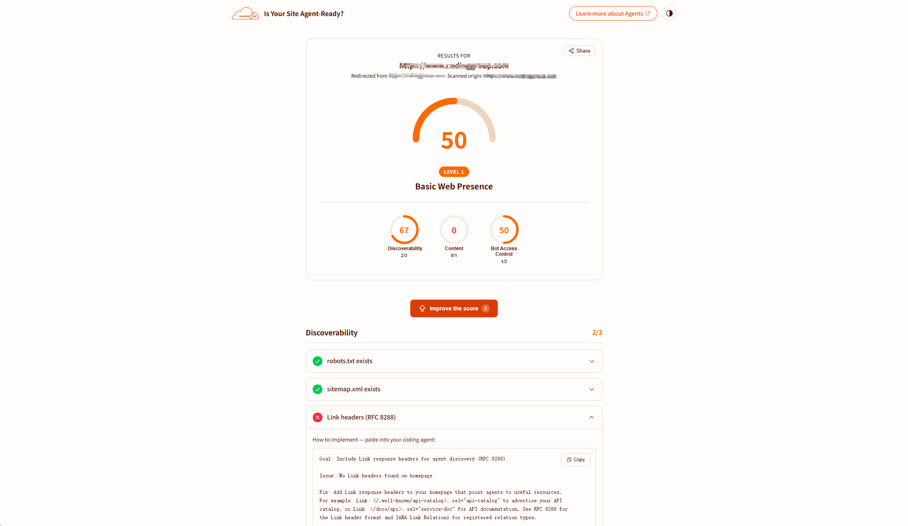
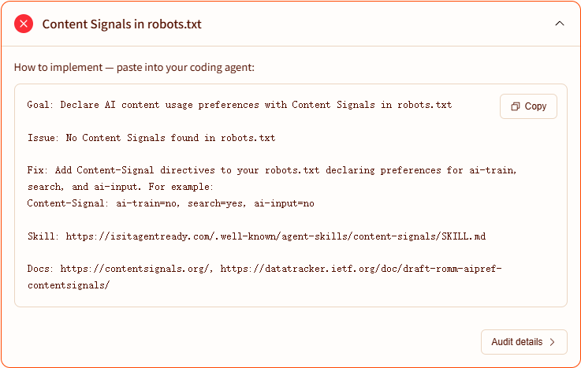

就在昨天（2026年4月17日），Cloudflare 正式上线了一款全新的免费工具：[isitagentready](https://isitagentready.com/)。

简单来说，这是一个网站 AI 代理友好度检测工具。它能够帮助你快速评估自己的站点，使其更好地适应 AI 代理（Agentic AI）的访问、理解和交互需求。

## 扫描模式

在使用前，用户可根据站点性质选择合适的检测模式：

- All Checks：运行全部检测项目。
- Content Site：适用于博客、文档、营销网站等以内容为主的站点。
- API / Application：适用于提供 API 服务或复杂 Web 应用的站点。

工具将检测分为五个维度：

1. Discoverability：检查 robots.txt、Sitemap 以及 Link 响应头，确保 AI 代理能够快速发现和定位站点资源。
2. Content Accessibility ：重点检测 Markdown Content Negotiation（Markdown 内容协商），如果网站支持以 Markdown 格式返回内容，AI 代理就能以更高效、Token 消耗更低的方式获取结构化内容。
3. Bot Access Control：包括 robots.txt 中的 AI bot 规则、Content Signals 以及 Web Bot Auth，它能让你以更精细化的方式管理哪些内容 AI 能爬、哪些不能。
4. Protocol Discovery：检测 MCP Server Card、Agent Skills、WebMCP、API Catalog、OAuth discovery、OAuth Protected Resource 等新兴标准，帮助 AI 代理自动发现站点的能力和接口。
5. Commerce：检查 x402、UCP、ACP 等 agentic commerce 协议，支持让 AI 代理完成支付、授权等商业交互。

## 提供优化建议

在检测完成后，isitagentready 不仅会给出网站的整体评分（0–100）以及各维度的诊断结果，还会针对未通过的检查项，生成可直接用于优化的提示词，以便于站长快速修复网站。

例如，当检测到网站的 robots.txt 中缺少针对 AI 内容使用偏好的声明时，isitagentready 就会提供一段可用于优化的提示词。你只需要将该提示词复制并粘贴到你的 AI Agent 中，即可由 AI 自动完成相应的修复与配置调整。

## 为什么要关注 Agent Readiness

由于 AI 的发展，网站的优化也从原来单一的 SEO 优化转向了 SEO 与 GEO 的结合。

在传统模式下，网站优化主要围绕提升用户的可读性以及搜索引擎的抓取与理解能力展开。而在当前环境中，还需要进一步提升内容对 AI 的可理解性。AI 代理更依赖结构化、易发现、可控且低成本的信息获取方式。

Cloudflare 提供的相关工具，能够帮助站长更清晰地评估并优化网站，使其更符合 GEO 的要求，从网站自身结构和内容层面提升对 AI 的适配能力。

与此同时，[Cloudflare Agents](https://agents.cloudflare.com/) 也提供了完整的 AI 代理构建能力，并与 [isitagentready](https://isitagentready.com/) 形成从“Building Agents”到“Optimizing Websites for AI Agents”的闭环。
