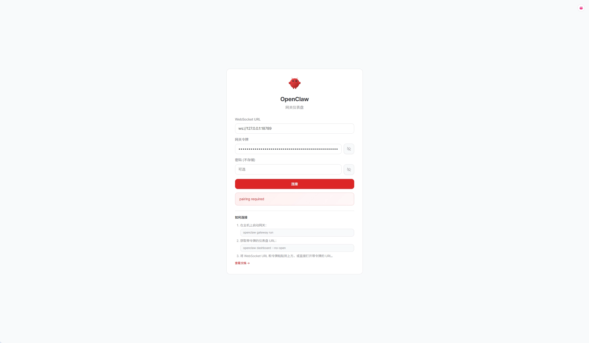
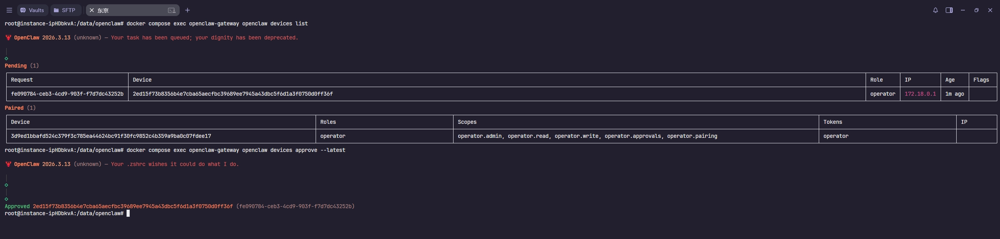
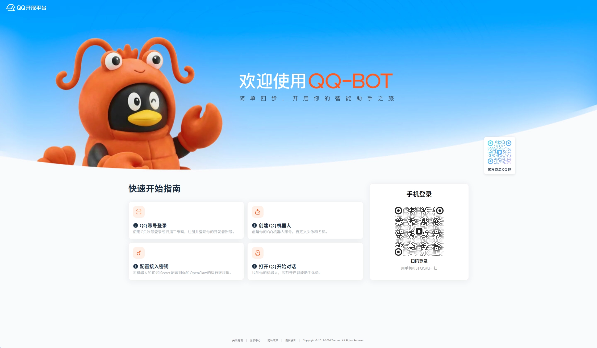
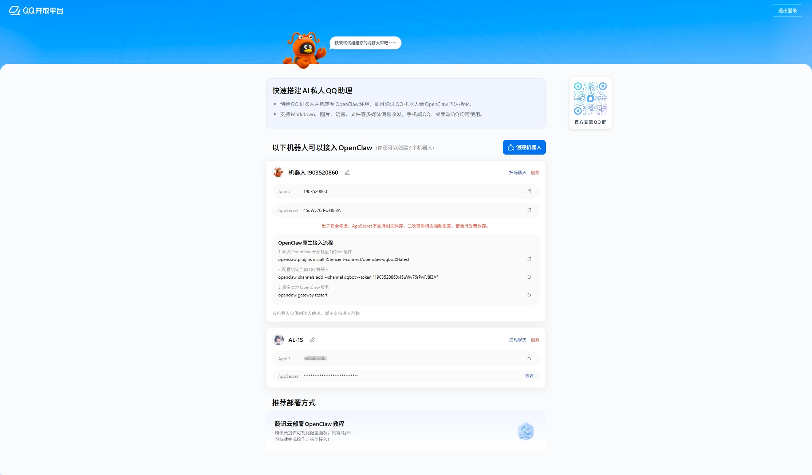

## 前置准备

### 软件要求

确保服务器上已安装 Docker 和 Docker Compose：

```bash
# 检查 Docker 版本
docker --version

# 检查 Docker Compose 版本
docker compose version
```

如果尚未安装，可以看我前面的教程：[Linux安装Docker完整教程](https://blog.zsdy.dev/posts/installing-docker-on-linux-a-complete-guide)

## 部署步骤

### 步骤 1：创建目录结构

```bash
# 创建主目录
mkdir -p /data/openclaw

# 创建 OpenClaw 配置和工作区目录
mkdir -p /data/openclaw/.openclaw/workspace

# 设置正确的所有权
# UID 1000 是容器内 node 用户的 UID，确保容器有读写权限
sudo chown -R 1000:1000 /data/openclaw/.openclaw
```

> **为什么是 1000:1000？**
>
> OpenClaw 官方镜像使用 `node` 用户运行（UID 1000）。如果宿主机目录权限不匹配，容器内将无法写入配置，导致启动失败。

### 步骤 2：生成 Token

```bash
# 生成 256 位（32 字节）随机 token
openssl rand -hex 32
# 示例输出: a1b2c3d4e5f6...
```

### 步骤 3：创建环境变量文件

```bash
cat > /data/openclaw/.env <<'EOF'
# ========================================
# 镜像配置
# ========================================
OPENCLAW_IMAGE=ghcr.io/openclaw/openclaw:latest

# ========================================
# 安全配置
# ========================================
# Gateway 认证 Token，请替换为步骤 2 生成的值
OPENCLAW_GATEWAY_TOKEN=<你的随机token>

# Gateway 绑定模式
# - lan: 监听所有局域网接口（0.0.0.0）
# - local: 仅监听本地回环（127.0.0.1）
OPENCLAW_GATEWAY_BIND=lan

# ========================================
# 时区配置
# ========================================
OPENCLAW_TZ=Asia/Shanghai

# ========================================
# 目录配置
# ========================================
# 配置文件存储目录
OPENCLAW_CONFIG_DIR=/data/openclaw/.openclaw
# Agent 工作区目录
OPENCLAW_WORKSPACE_DIR=/data/openclaw/.openclaw/workspace

# ========================================
# 端口配置
# ========================================
# Gateway WebSocket 端口
OPENCLAW_GATEWAY_PORT=18789
# Bridge Server 端口
OPENCLAW_BRIDGE_PORT=18790
EOF
```

### 步骤 4：创建 Docker Compose 配置文件

```bash
cat > /data/openclaw/docker-compose.yml <<'EOF'
services:
  # ========================================
  # Gateway 服务
  # ========================================
  openclaw-gateway:
    image: ${OPENCLAW_IMAGE}
    container_name: openclaw-gateway
    environment:
      # 容器内用户主目录
      HOME: /home/node
      # 终端类型（支持彩色输出）
      TERM: xterm-256color
      # Gateway 认证 Token
      OPENCLAW_GATEWAY_TOKEN: ${OPENCLAW_GATEWAY_TOKEN:-}
      # 时区
      TZ: ${OPENCLAW_TZ:-UTC}
    volumes:
      # 挂载配置目录
      - ${OPENCLAW_CONFIG_DIR}:/home/node/.openclaw
      # 挂载工作区目录
      - ${OPENCLAW_WORKSPACE_DIR}:/home/node/.openclaw/workspace
    ports:
      # Gateway WebSocket 端口
      - "${OPENCLAW_GATEWAY_PORT:-18789}:18789"
      # Bridge Server 端口
      - "${OPENCLAW_BRIDGE_PORT:-18790}:18790"
    # 使用 init 进程处理子进程和信号
    init: true
    # 重启策略：除非手动停止，否则自动重启
    restart: unless-stopped
    # 启动命令
    command:
      [
        "node",
        "dist/index.js",
        "gateway",
        "--bind",
        "${OPENCLAW_GATEWAY_BIND:-lan}",
        "--port",
        "18789",
      ]
    # 健康检查
    healthcheck:
      test:
        [
          "CMD",
          "node",
          "-e",
          "fetch('http://127.0.0.1:18789/healthz').then((r)=>process.exit(r.ok?0:1)).catch(()=>process.exit(1))",
        ]
      interval: 30s    # 每 30 秒检查一次
      timeout: 5s       # 超时时间
      retries: 5        # 失败 5 次后标记为不健康
      start_period: 20s # 启动后 20 秒才开始检查

  # ========================================
  # CLI 管理容器
  # ========================================
  openclaw-cli:
    image: ${OPENCLAW_IMAGE}
    container_name: openclaw-cli
    # 共享 Gateway 的网络命名空间
    # 这样 CLI 可以通过 localhost 访问 Gateway
    network_mode: "service:openclaw-gateway"
    # 安全加固：移除不必要的网络权限
    cap_drop:
      - NET_RAW
      - NET_ADMIN
    security_opt:
      - no-new-privileges:true
    environment:
      HOME: /home/node
      TERM: xterm-256color
      OPENCLAW_GATEWAY_TOKEN: ${OPENCLAW_GATEWAY_TOKEN:-}
      # 禁用浏览器（CLI 不需要）
      BROWSER: echo
      TZ: ${OPENCLAW_TZ:-UTC}
    volumes:
      - ${OPENCLAW_CONFIG_DIR}:/home/node/.openclaw
      - ${OPENCLAW_WORKSPACE_DIR}:/home/node/.openclaw/workspace
    # 保持 STDIN 打开（支持交互式命令）
    stdin_open: true
    # 分配伪终端
    tty: true
    init: true
    # CLI 容器的入口点
    entrypoint: ["node", "dist/index.js"]
    # 依赖 Gateway 启动
    depends_on:
      - openclaw-gateway
EOF
```

### 步骤 5：启动服务

```bash
cd /data/openclaw

# 运行初始化向导
docker compose run --rm openclaw-cli onboard
```

#### 步骤 5.1 配置 allowedOrigins

由于我们使用了 `OPENCLAW_GATEWAY_BIND=lan`，需要在配置文件中明确允许的访问来源（CORS）：

```bash
# 使用文本编辑器修改配置文件
vim /data/openclaw/.openclaw/openclaw.json
```

在 `gateway` 配置中添加 `controlUi.allowedOrigins`：

```json
{
 "gateway": {
  "controlUi": {
   "allowedOrigins": ["http://127.0.0.1:18789"]
  }
 }
}
```

### 步骤 6：启动服务

```bash
# 启动 Gateway 服务
docker compose up -d openclaw-gateway

# 查看服务状态
docker compose ps

# 查看日志（如果启动失败）
docker compose logs -f openclaw-gateway
```

### 步骤 7：配置 SSH 隧道与控制面板访问

#### 步骤 7.1 建立 SSH 隧道

```bash
# 基本语法
ssh -N -L 本地端口:目标主机:目标端口 用户名@服务器IP

# 示例：将本地 18789 端口转发到服务器的 127.0.0.1:18789
ssh -N -L 18789:127.0.0.1:18789 用户名@服务器IP
```

| 参数                    | 说明                         |
| :---------------------- | :--------------------------- |
| `-N`                    | 不执行远程命令，仅做端口转发 |
| `-L`                    | 本地端口转发                 |
| `18789:127.0.0.1:18789` | 本地端口:远程主机:远程端口   |

> **使用密钥认证（推荐）**：
>
> ```bash
> ssh -N -i ~/.ssh/your_key -L 18789:127.0.0.1:18789 用户名@服务器IP
> ```

#### 步骤 7.2 访问控制面板

SSH 隧道建立后，在本地浏览器打开：`http://127.0.0.1:18789`

输入之前生成的 `OPENCLAW_GATEWAY_TOKEN` 登录。

#### 步骤 7.3 设备配对

首次登录时，会遇到 `pairing required` 错误：



这是 OpenClaw 的安全机制，需要手动批准连接请求。

**在服务器上执行以下命令**：

```bash
# 查看待处理的配对请求
docker compose exec openclaw-gateway openclaw devices list

# 批准最新的待处理请求
docker compose exec openclaw-gateway openclaw devices approve --latest
```



> **`devices` 命令详解**：
>
> | 命令                       | 作用                         |
> | :------------------------- | :--------------------------- |
> | `devices list`             | 列出所有待处理和已配对的设备 |
> | `devices approve <id>`     | 批准特定的配对请求           |
> | `devices approve --latest` | 批准最新的待处理请求         |
> | `devices remove <id>`      | 移除已配对的设备             |
> | `devices clear --yes`      | 清除所有配对（危险！）       |

批准后，刷新浏览器即可正常登录控制面板。

## QQ 机器人接入

### 步骤 1：创建 QQ 机器人

访问 [QQ 开放平台](https://q.qq.com/qqbot/openclaw/login.html)：



点击创建机器人：



### 步骤 2：安装 QQ 机器人插件

```bash
docker compose exec openclaw-gateway openclaw plugins install @tencent-connect/openclaw-qqbot@latest
```

### 步骤 3：添加 QQ 机器人渠道

```bash
# 注意：所有 openclaw 命令都需要在容器内执行
# 格式：docker compose exec <service> <command>

docker compose exec openclaw-gateway openclaw channels add --channel qqbot --token "AppID:AppSecret"
```

> **命令结构解析**：
>
> | 部分                    | 说明                   |
> | :---------------------- | :--------------------- |
> | `docker compose exec`   | 在运行的容器中执行命令 |
> | `openclaw-gateway`      | 目标服务名             |
> | `openclaw channels add` | OpenClaw 添加渠道命令  |
> | `--channel qqbot`       | 指定渠道类型           |
> | `--token`               | 机器人凭据             |

### 步骤 4：重启 Gateway 使配置生效

```bash
docker compose exec openclaw-gateway openclaw gateway restart
```

或者直接重启容器：

```bash
docker compose restart openclaw-gateway
```

### 步骤 5：验证 QQ 机器人状态

```bash
# 查看已配置的渠道
docker compose exec openclaw-gateway openclaw channels list

# 查看日志
docker compose logs -f openclaw-gateway | grep qqbot
```
